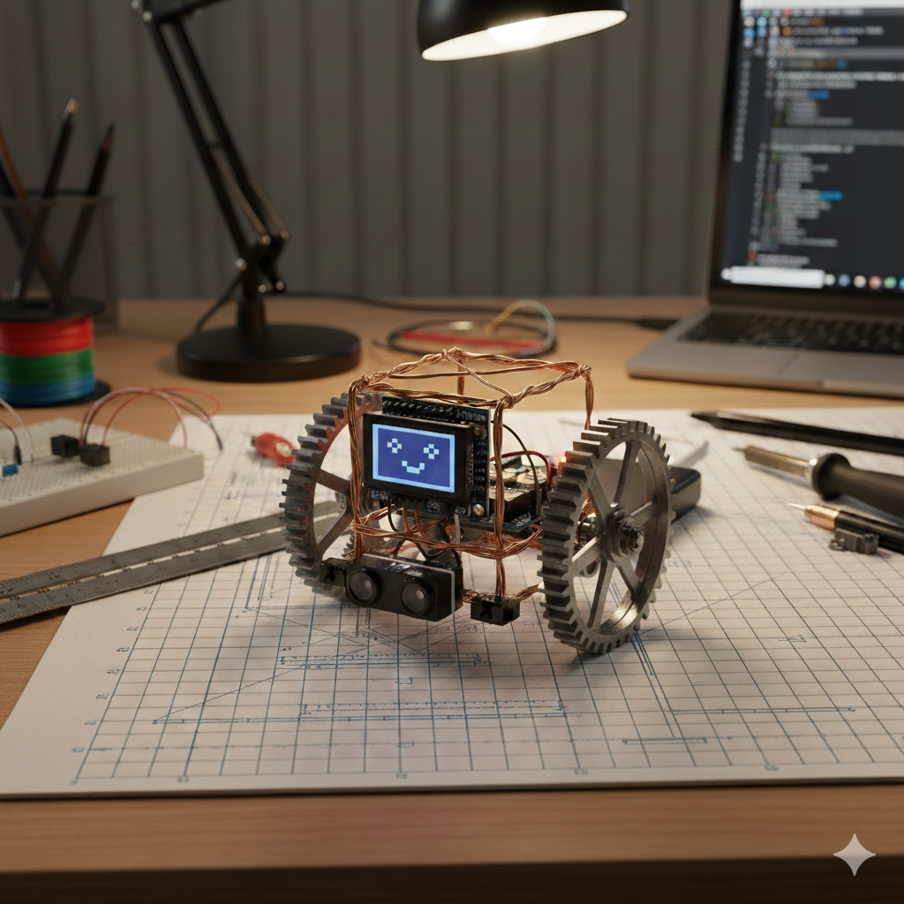

# Tiny Pet



Small desk pet robot (TinyGo): random movement, obstacle avoidance (ultrasonic), edge avoidance (IR), OLED face expressions. Runs on Arduino Uno/Nano or STM32 Blue Pill.

## Requirements

- **Board:** Arduino Uno (`arduino`), Arduino Nano (`arduino-nano`), or STM32 Blue Pill (`bluepill`). Arduino: 5 V logic. Blue Pill: 3.3 V logic.
- **Software:** Go 1.20+, [TinyGo](https://tinygo.org/getting-started/install/). For Arduino: avrdude (used by TinyGo flash). For Blue Pill: [OpenOCD](http://openocd.org/) and ST-Link v2 programmer.

## Features

- **Random movement** — Drives forward and occasionally turns at random to wander on a flat surface.
- **Obstacle avoidance** — Ultrasonic sensor (HC-SR04) detects obstacles ahead; robot stops, reverses, then turns away. Threshold: `OBSTACLE_DISTANCE_THRESHOLD` in `sensors.go`.
- **Edge detection** — Two front IR sensors (A1–A2) detect desk edges; robot stops, reverses, and turns to avoid falling. Threshold: `EDGE_DETECTION_THRESHOLD` in `sensors.go`.
- **OLED face** — SSD1306 128x64 I2C OLED shows expressive faces: happy (moving), surprised (obstacle), scared (edge), excited (interacting), neutral (idle), with periodic blink animation.
- **Interaction (optional)** — Status LED (D13) and buzzer (D8) indicate current state (moving, avoiding obstacle, avoiding edge). Calibration on startup is indicated by LED blinks and beeps.

## Parts list

### Board

| Item                          | Note                                                                     |
| ----------------------------- | ------------------------------------------------------------------------ |
| Arduino Uno or Arduino Nano   | Uno: target `arduino`. Nano: target `arduino-nano`. 5 V.                 |
| STM32 Blue Pill (STM32F103C8) | Target `bluepill`. 3.3 V. Low-cost option; requires ST-Link v2 to flash. |

### Required

| Component                  | Qty | Spec                                                                                       |
| -------------------------- | --- | ------------------------------------------------------------------------------------------ |
| Mini L298N motor driver    | 1   | H-bridge, 4 logic pins (IN1–IN4). ENA/ENB jumper → HIGH. Motor power from separate supply. |
| DC gear motors             | 2   | 3–6 V DC gear motor (17–68 RPM range).                                                     |
| Steel gear 65T (wheels)    | 2   | Press-fit on motor shaft, acts as wheel.                                                   |
| Copper wire frame          | —   | 1 mm (structural) + 0.7 mm (detail). Forms the body/chassis.                               |
| Ultrasonic distance sensor | 1   | HC-SR04 or compatible. Trig + Echo (digital).                                              |
| IR sensors (analog)        | 2   | Analog output to A1–A2 (front). Lower ADC = edge (e.g. TCRT5000-style).                    |
| SSD1306 OLED display       | 1   | I2C (addr 0x3C). A4 (SDA), A5 (SCL). See **Recommended display** below.                    |
| Power supply (USB/adapter) | 1   | 5 V for Uno/Nano (USB or regulated adapter). Alternative: battery stack below.               |
| 3.7V Li-ion battery (1S)   | 1   | For battery operation (desk roaming). e.g. 18650, 14500, or pouch.                         |
| 1S protection module       | 1   | Use with battery. Over-discharge/overcharge/short protection (B+/B-/P+/P-).                |
| 5V boost converter         | 1   | 3.x V → 5V (e.g. MT3608). Input/output capacitors recommended.                             |
| 5V→3.3V LDO (optional)     | 1   | For Blue Pill or 3.3V peripherals (e.g. AMS1117-3.3).                                      |

### Optional

| Component     | Pin in code                            |
| ------------- | -------------------------------------- |
| Status LED    | D13 (often built-in)                   |
| Buzzer        | D8 (other leg GND)                     |
| MPU6050 (I2C) | SDA, SCL                               |
| Button        | Free digital pin (not in current code) |

### Recommended display (fits 2KB SRAM)

**Use a 128×32 I2C OLED.** Firmware uses a 512-byte buffer; the face fills the screen.

| Product                                                                                   | Spec             | Note                               |
| ----------------------------------------------------------------------------------------- | ---------------- | ---------------------------------- |
| [Adafruit 4440 – Monochrome 0.91" 128×32 I2C OLED](https://www.adafruit.com/product/4440) | 128×32, I2C 0x3C | STEMMA QT / Qwiic; 4-pin. ~$12.50. |
| Generic 0.91" 128×32 SSD1306 I2C                                                          | 128×32, I2C 0x3C | Many clones; ensure I2C (not SPI). |

We support Uno/Nano (2KB SRAM) only. If you use a 128×64 OLED on them, the face is drawn in the **top half** only.

## Wiring (Arduino pins)

```
D5, D4  → Mini L298N IN1, IN2 (left motor).  H-bridge: fwd/rev/stop.
D6, D9  → Mini L298N IN3, IN4 (right motor). ENA/ENB jumper → HIGH.
D7, A0  → Ultrasonic Trig, Echo (HC-SR04)
A1–A2   → IR edge sensors (analog, front only). Lower ADC = edge.
A4, A5  → SSD1306 OLED (I2C SDA, SCL). Hardware I2C on ATmega328P.
D13, D8 → Optional: LED, Buzzer
```

Pin constants: `hardware_arduino.go` (Uno/Nano) or `hardware_bluepill.go` (Blue Pill). Thresholds: `sensors.go` / `sensors_bluepill.go` (`OBSTACLE_DISTANCE_THRESHOLD`, `EDGE_DETECTION_THRESHOLD`).

## Wiring (STM32 Blue Pill)

```
PA8, PA9   → Mini L298N IN1, IN2 (left motor)
PA10, PA11 → Mini L298N IN3, IN4 (right motor)
PA12, PB10 → Ultrasonic Trig, Echo (HC-SR04). Avoid PA13/PA14 (SWD).
PA1, PA2   → IR edge sensors (ADC1, ADC2)
PB7, PB6   → SSD1306 OLED I2C SDA, SCL (I2C0)
PC13       → Status LED (onboard)
PB15       → Buzzer
```

Flash: connect ST-Link v2 to Blue Pill SWD (SWIO, SWCLK, 3V3, GND), then `make flash-bluepill`. Install OpenOCD (e.g. `brew install openocd`) if needed.

## Build & flash

Use the [Makefile](Makefile) for build, flash, format, and tests. Run `make help` for all targets.

| Command               | Description                                             |
| --------------------- | ------------------------------------------------------- |
| `make build`          | Build for Blue Pill (default) → `firmware_bluepill.elf` |
| `make build-uno`      | Build for Arduino Uno → `firmware.hex`                  |
| `make build-nano`     | Build for Arduino Nano                                  |
| `make flash`          | Flash Uno to board (PORT auto-detected on macOS)        |
| `make flash-nano`     | Flash Nano to board                                     |
| `make flash-bluepill` | Flash Blue Pill (ST-Link v2 + OpenOCD)                  |
| `make fmt`            | Format Go code                                          |
| `make tidy`           | `go mod tidy`                                           |
| `make test`           | Run unit tests                                          |
| `make run`            | Run in emulator (no board)                              |
| `make clean`          | Remove firmware artifacts                               |

Examples:

```bash
make build                    # Blue Pill (default)
make build-uno                # Uno
make build-nano flash-nano    # Nano: build then flash
make flash-bluepill           # Blue Pill (ST-Link v2 connected)
make flash PORT=/dev/cu.usbmodem14101   # macOS, set port explicitly
make flash PORT=COM3                    # Windows
```

### Firmware size (Arduino Uno/Nano 32KB flash)

The Makefile applies [TinyGo optimization flags](https://tinygo.org/docs/guides/optimizing-binaries/) (`-scheduler=none`, `-gc=leaking`). Calibration `println` output is gated by a `debug` build tag so release builds use a no-op and save space. The firmware may still slightly exceed 32KB on Uno/Nano; if the build reports overflow, you can build with `-tags=debug` for development (serial output) or consider a board with more flash.

## Run

Wire → power 5 V → flash. On startup: short calibration (LED/beep). Then it wanders and avoids obstacles/edges.

## Development

### Project layout

| Path                                           | Description                                                                        |
| ---------------------------------------------- | ---------------------------------------------------------------------------------- |
| `main.go`                                      | Entry point, main loop, module wiring                                              |
| `hardware_arduino.go` / `hardware_bluepill.go` | Pin constants, `Motor`, `Robot`, board init (build tag selects)                    |
| `motors.go`                                    | `MotorController` — direction, speed, timed moves                                  |
| `sensors.go` / `sensors_bluepill.go`           | `SensorModule` — ultrasonic, IR, thresholds (Blue Pill uses time-based ultrasonic) |
| `navigation.go`                                | `NavigationModule` — state machine, behavior mode                                  |
| `behaviors.go`                                 | `BehaviorPatterns` — LED and buzzer feedback                                       |
| `display.go`                                   | `DisplayModule` — SSD1306 OLED face expressions                                    |
| `faces.go`                                     | Procedural face drawing (helpers + 6 expressions)                                  |
| `calibration.go`                               | `CalibrationModule` — sensor/motor calibration                                     |
| `internal/navlogic/`                           | Pure state logic (no hardware); unit-testable                                      |

### Emulator (no board)

Run firmware under simavr to check that the program starts and the main loop runs. Sensor and motor I/O are simulated (default values), so behavior will not match real hardware.

```bash
# macOS: simavr is in the osx-cross/avr tap (not in default Homebrew)
brew tap osx-cross/avr
brew install simavr
make run
```

### Unit tests

Navigation state logic only (sensor inputs → next state). Uses the standard Go toolchain; no TinyGo or board needed.

```bash
make test
```

### Tuning

- Obstacle/edge thresholds: `sensors.go` or `sensors_bluepill.go` (`OBSTACLE_DISTANCE_THRESHOLD`, `EDGE_DETECTION_THRESHOLD`).
- Avoidance timings: `navigation.go`. Runtime adjustment via `CalibrationModule.AdjustThresholds()`.
- Blue Pill: if ultrasonic distance is wrong, adjust `bluepillLoopsPerMicrosecond` in `sensors_bluepill.go`.

## License

MIT. See [LICENSE](LICENSE).
